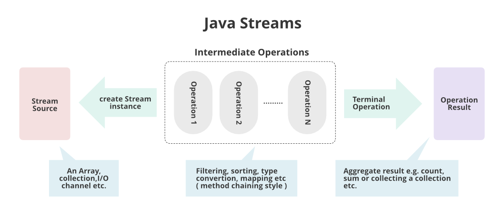
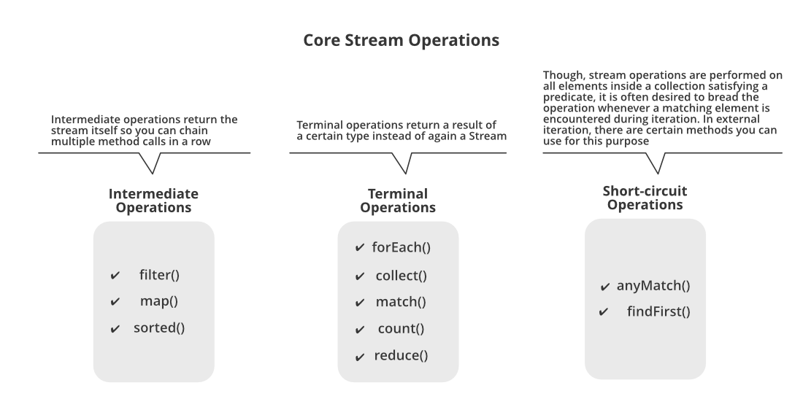

# Java 8 Features

Before Java 8, developers faced several challenges when writing code that dealt with behavioral patterns and data processing.</br>
These challenges made code verbose, difficult to read, and hard to maintain.</br>

## The Problem Before Java 8

### 1. Verbose Anonymous Classes

Before Java 8, when you needed to pass behavior as a parameter (like event handling or custom sorting), you had to use anonymous inner
classes:

```java
// Old way - Anonymous inner class
Collections.sort(employees, new Comparator<Employee>() {
	@Override
	public int compare (Employee e1, Employee e2){
		return e1.getName().compareTo(e2.getName());
	}
});
```

This approach was:

- **Verbose**: Too much boilerplate code for simple operations
- **Hard to read**: The actual logic was buried in syntax
- **Error-prone**: Easy to make mistakes with the verbose syntax

### 2. Null Pointer Exceptions

Handling null values was always a source of bugs:

```java
// Risky code - can throw NullPointerException
Order order = orderService.findById(123);
String customerName = order.getCustomerName().toUpperCase(); // What if order is null?
```

### 3. Complex Data Processing

Processing collections required verbose loops and temporary variables:

```java
// Old way - filtering and transforming data
List<String> highValueCustomers = new ArrayList<>();
for(Order order :orders){
		if(order.getTotalValue() >1000){
		highValueCustomers.add(order.getCustomerName());
		}
		}
```

---

## Java 8 Solutions

Java 8 introduced revolutionary features that solved these problems:

## 1. Functional Interfaces and Lambda Expressions

### What is a Functional Interface?

A **Functional Interface** is an interface that contains **exactly one abstract method**. It can have multiple default and static methods,
but only one abstract method.

```java

@FunctionalInterface
public interface ExampleInterface {
	void exampleMethod(String msg);        // Single abstract method

	default void defaultMethod(String msg) {  // Default method (allowed)
		System.out.println("Default: " + msg);
	}

	static void staticMethod(String msg) {    // Static method (allowed)
		System.out.println("Static: " + msg);
	}
}
```

### Why Do We Need Functional Interfaces?

**The Problem**: In Java, you cannot pass methods as arguments directly. You can only pass objects.

**The Solution**: Functional interfaces act as a contract for lambda expressions, allowing us to treat functions as first-class citizens.

### Lambda Expressions - The Game Changer

Lambda expressions provide a clear and concise way to represent one method interface using an expression.

**Syntax**: `(parameters) -> expression` or `(parameters) -> { statements; }`

Let's see the evolution from traditional approach to lambda:

```java
// 1. Traditional approach - Create a class that implements the interface
public class ExampleClass implements ExampleInterface {
	@Override
	public void exampleMethod(String msg) {
		System.out.println(msg);
	}
}

ExampleInterface ex = new ExampleClass();
ex.exampleMethod("from concrete class");

// 2. Anonymous class - No separate class file needed
ExampleInterface ex2 = new ExampleInterface() {
	@Override
	public void exampleMethod(String msg) {
		System.out.println(msg);
	}
};

ex2.exampleMethod("from anonymous class");

// 3. Lambda expression - Clean and concise
ExampleInterface ex3 = msg -> System.out.println(msg);
ex3.exampleMethod("from lambda expression");

// 4. Method reference - Even more concise
ExampleInterface ex4 = System.out::println;
ex4.exampleMethod("from method reference");
```

### Method References

Method references are a shorthand notation of lambda expressions to call a method.

**Types of Method References:**

1. **Static Method Reference**: `ClassName::staticMethodName`
2. **Instance Method Reference**: `instance::methodName`
3. **Constructor Reference**: `ClassName::new`

```java
// Static method reference
ExampleInterface ex5 = ExampleInterface::staticMethod;

// Using with Thread (Runnable is a functional interface)
Thread thread = new Thread(() -> System.out.println("in thread"));
```

### Built-in Functional Interfaces

Java 8 provides several ready-to-use functional interfaces in `java.util.function` package:

#### 1. Consumer<T>

- **Purpose**: Takes an argument and returns nothing (void)
- **Method**: `void accept(T t)`
- **Use Case**: Performing operations on data without returning anything

```java
Consumer<String> consumer = x -> System.out.println(x);
consumer.accept("consumed value");

// Real-world example
List<String> names = Arrays.asList("Ahmed", "Mohamed", "Sara");
names.forEach(consumer); // Prints each name
```

#### 2. Supplier<T>

- **Purpose**: Takes no arguments but returns a value
- **Method**: `T get()`
- **Use Case**: Lazy initialization, factory methods

```java
Supplier<String> supplier = () -> "supplied value";
System.out.println(supplier.get());

// Real-world example - generating random values
Supplier<Integer> randomGenerator = () -> (int) (Math.random() * 100);
System.out.println("Random number: "+randomGenerator.get());
```

#### 3. Predicate<T>

- **Purpose**: Takes a parameter and returns a boolean
- **Method**: `boolean test(T t)`
- **Use Case**: Filtering, validation, conditional logic

```java
Predicate<String> predicate = x -> x.length() == 10;
System.out.println(predicate.test("test value")); // false

// Real-world example - filtering
List<Integer> numbers = Arrays.asList(1, 2, 3, 4, 5, 6, 7, 8, 9, 10);
List<Integer> evenNumbers = numbers.stream()
		.filter(n -> n % 2 == 0)  // Predicate used here
		.collect(Collectors.toList());
```

#### 4. Function<T, R>

- **Purpose**: Takes a parameter and returns a value (transformation)
- **Method**: `R apply(T t)`
- **Use Case**: Data transformation, mapping

```java
Function<String, Integer> function = str -> str.length();
System.out.println(function.apply("test string")); // 11

// Real-world example - transformation
List<String> words = Arrays.asList("hello", "world", "java");
List<Integer> lengths = words.stream()
		.map(function)  // Transform string to its length
		.collect(Collectors.toList());
```

---

## 2. Enhanced forEach Method

### The Problem with Traditional Loops

Before Java 8, iterating through collections required verbose syntax:

```java
List<Integer> nums = Arrays.asList(1, 2, 3, 4, 5);

// Traditional for loop
for(
int i = 0; i <nums.

size();

i++){
		System.out.println(nums.get(i));
		}

// Enhanced for loop (Java 5)
		for(
Integer num :nums){
		System.out.println(num);
}
```

### The Java 8 Solution

The `forEach` method was added to the `Iterable` interface (which is extended by `Collection`):

```java
// forEach with lambda
nums.forEach(x ->System.out.println(x));

// forEach with method reference
		nums.

forEach(System.out::println);
```

**Benefits:**

- **More readable**: Intent is clearer
- **Functional style**: Encourages functional programming
- **Less error-prone**: No index management needed

---

## 3. Optional Class - Say Goodbye to NullPointerException

### The Billion-Dollar Mistake

Null references have been called "The Billion-Dollar Mistake" by their inventor. They cause:

- **NullPointerException**: The most common runtime exception
- **Defensive coding**: Excessive null checks everywhere
- **Unclear contracts**: Methods don't clearly indicate if they can return null

### How Optional Solves This

`Optional<T>` is a container object that may or may not contain a non-null value.

**Traditional Approach (Risky):**

```java
public Order findOrderById(int targetId) {
	for (Order order : orders) {
		if (order.getId() == targetId) {
			return order;
		}
	}
	return null; // Potential source of NPE
}

// Usage - risky
Order order = orderRepository.findOrderById(19);
System.out.println(order.getCustomerName()); // NullPointerException if order is null!
```

**Java 8 Approach (Safe):**

```java
public Optional<Order> findOrderByIdWithOptional(int targetId) {
	for (Order order : orders) {
		if (order.getId() == targetId) {
			return Optional.of(order);      // Wrap found object
		}
	}
	return Optional.empty();                // Explicit "no value"
}
```

### Working with Optional

#### 1. Checking if Value is Present

```java
Optional<Order> orderOptional = orderRepository.findOrderByIdWithOptional(19);

// Safe check
if(orderOptional.

isPresent()){
		System.out.println(orderOptional.get().

getItems());
		}
```

#### 2. Performing Actions if Present

```java
// Execute action only if value is present
orderOptional.ifPresent(order ->System.out.println(order.getId()));
```

#### 3. Providing Default Values

```java
// Return default value if empty
Order order = orderRepository.findOrderByIdWithOptional(19)
				.orElse(new Order()); // Default order if not found

// Alternative: provide default through supplier
Order order2 = orderRepository.findOrderByIdWithOptional(19)
		.orElseGet(() -> createDefaultOrder());
```

#### 4. Throwing Exceptions for Missing Values

```java
// Throw custom exception if empty
Order order = orderRepository.findOrderByIdWithOptional(19)
				.orElseThrow(() -> new RuntimeException("Order not found"));
```

### Optional Best Practices

 **DO:**

- Use Optional as return type for methods that might not return a value
- Chain Optional methods for cleaner code
- Use `orElse()` for simple default values
- Use `orElseGet()` for expensive default value computation

L **DON'T:**

- Use Optional for fields in classes
- Use Optional for method parameters
- Call `get()` without checking `isPresent()`

---

## Real-World Benefits

### Before Java 8 vs After Java 8

**Before Java 8:**

```java
// Filtering and transforming - verbose and error-prone
List<String> activeCustomerNames = new ArrayList<>();
for(
Order order :orders){
		if(order.

getStatus().

equals("ACTIVE")){
String customerName = order.getCustomerName();
        if(customerName !=null){
		activeCustomerNames.

add(customerName.toUpperCase());
		}
		}
		}
```

**After Java 8:**

```java
// Clean, readable, and safe
List<String> activeCustomerNames = orders.stream()
				.filter(order -> "ACTIVE".equals(order.getStatus()))
				.map(Order::getCustomerName)
				.filter(Objects::nonNull)  // Handle nulls safely
				.map(String::toUpperCase)
				.collect(Collectors.toList());
```

### Key Advantages of Java 8 Features

1. **Conciseness**: Less boilerplate code
2. **Readability**: Code expresses intent more clearly
3. **Safety**: Optional helps prevent NullPointerException
4. **Functional Style**: Encourages immutable, side-effect-free programming
5. **Performance**: Streams can be parallelized easily
6. **Maintainability**: Cleaner code is easier to maintain

---

## Summary

Java 8 transformed Java programming by introducing:

- **Lambda Expressions**: Making code more concise and readable
- **Functional Interfaces**: Enabling functional programming concepts
- **Method References**: Further reducing boilerplate
- **Built-in Functional Interfaces**: Ready-to-use functional contracts
- **Enhanced forEach**: Simpler iteration over collections
- **Optional**: Safe handling of potentially null values

These features work together to make Java code more expressive, safer, and easier to maintain while embracing functional programming
principles alongside object-oriented programming.

---

## 4. Stream API - The Data Processing Revolution

### The Problem with Traditional Data Processing

Before Stream API, processing collections of data required verbose, imperative code with multiple steps:

```java
// Traditional approach - verbose and error-prone
List<Integer> nums = Arrays.asList(1, 2, 3, 4, 5, 6, 7, 8, 9, 10, 10);

// Filter even numbers, double them, and sum them up
int sumOfEvenNumbersUsingForLoop = 0;
for(
int i = 0; i <nums.

size();

i++){
		if(nums.

get(i) %2==0){           // Filter
int doubled = nums.get(i) * 2;     // Transform
sumOfEvenNumbersUsingForLoop +=doubled; // Accumulate
    }
			}
			System.out.println(sumOfEvenNumbersUsingForLoop); // Output: 60
```

**Problems with this approach:**

- **Verbose**: Too much boilerplate code
- **Error-prone**: Easy to make mistakes with loops and conditions
- **Hard to read**: The actual business logic is buried in loop mechanics
- **Not reusable**: Each data processing task requires writing similar loop structures
- **Sequential only**: Difficult to parallelize

### What is Stream API?

Think of Stream API as an **assembly line in a factory**:

🏭 **Assembly Line Analogy:**

- **Raw materials** → Your original data collection
- **Conveyor belt** → The Stream
- **Work stations** → Stream operations (filter, map, reduce)
- **Final product** → The result you want

```java
// Stream approach - clean and declarative
int sumOfEvenNumbersUsingStream = nums.stream()    // Create the "conveyor belt"
				.filter(num -> num % 2 == 0)                   // Station 1: Filter even numbers
				.map(num -> num * 2)                           // Station 2: Double each number
				.reduce(0, (total, num) -> total + num);       // Station 3: Sum them up
System.out.println(sumOfEvenNumbersUsingStream);   // Output: 60
```

### Understanding Stream Concepts

#### 1. What is a Stream?

A Stream is **NOT** a data structure. It's a **sequence of elements** that supports various operations to process data in a functional
style.

**Key Characteristics:**

- **No storage**: Streams don't store data; they process data from a source
- **Functional**: Operations produce new streams without modifying the original data
- **Lazy**: Intermediate operations are not executed until a terminal operation is called
- **Consumable**: Once consumed, a stream cannot be reused

#### 2. Stream Pipeline Structure

Every stream operation follows this pattern:

```
Source → Intermediate Operations → Terminal Operation
```



**Example:**
```java
List<Integer> evenNumbers = nums.stream()     // Source
    .filter(num -> num % 2 == 0)             // Intermediate Operation
    .collect(Collectors.toList());           // Terminal Operation
```

### Stream Operations Deep Dive



#### Intermediate Operations (Returns a Stream)

##### 1. **filter()** - The Gatekeeper

**Purpose**: Keep only elements that match a condition
**Analogy**: Only lets in what meets the criteria

```java
List<Integer> nums = Arrays.asList(1, 2, 3, 4, 5, 6, 7, 8, 9, 10, 10);

// Filter even numbers
List<Integer> evenNumbers = nums.stream()
		.filter(num -> num % 2 == 0)  // Predicate: keep only even numbers
		.collect(Collectors.toList());
System.out.println(evenNumbers); // [2, 4, 6, 8, 10, 10]

// Remove duplicates using Set
Set<Integer> evenNumbersWithoutDuplicates = nums.stream()
		.filter(num -> num % 2 == 0)
		.collect(Collectors.toSet());
System.out.println(evenNumbersWithoutDuplicates); // [2, 4, 6, 8, 10]
```

##### 2. **map()** - The Transformer

**Purpose**: Transform each element to something else
**Analogy**: Like a machine that converts raw materials into finished products

```java
// Transform: double each even number
List<Integer> doubledEvens = nums.stream()
				.filter(num -> num % 2 == 0)
				.map(num -> num * 2)      // Transform: multiply by 2
				.collect(Collectors.toList());
System.out.println(doubledEvens); // [4, 8, 12, 16, 20, 20]

// Real-world example: Extract customer names from orders
OrderRepository orderRepository = new OrderRepository();
List<Order> orders = orderRepository.findAll();

List<String> customerNames = orders.stream()
		.map(order -> order.getCustomerName())  // Transform Order to String
		.collect(Collectors.toList());
```

##### 3. **flatMap()** - The Flattener

**Purpose**: Flatten nested structures into a single stream
**Analogy**: Like unpacking boxes within boxes to get all individual items

```java
// Get all items from all orders (flattening)
List<Item> allItems = orders.stream()
				.flatMap(order -> order.getItems().stream())  // Flatten List<List<Item>> to List<Item>
				.collect(Collectors.toList());
System.out.println(allItems);

// Visual representation:
// Order1: [Item1, Item2] ┐
// Order2: [Item3]        ├──► flatMap ──► [Item1, Item2, Item3, Item4, Item5]
// Order3: [Item4, Item5] ┘
```

#### Terminal Operations (Produces a Result)

##### 1. **collect()** - The Collector

**Purpose**: Convert stream back to a collection or other data structure

```java
// Collect to List
List<Integer> evenList = nums.stream()
				.filter(num -> num % 2 == 0)
				.collect(Collectors.toList());

// Collect to Set (removes duplicates)
Set<Integer> evenSet = nums.stream()
		.filter(num -> num % 2 == 0)
		.collect(Collectors.toSet());

// Collect to Map
Map<Integer, List<Item>> orderItemsMap = orders.stream()
		.collect(Collectors.toMap(
				order -> order.getId(),        // Key: Order ID
				order -> order.getItems()      // Value: List of Items
		));
```

##### 2. **reduce()** - The Accumulator

**Purpose**: Reduce all elements to a single value
**Analogy**: Like a calculator that keeps adding numbers to get a final total

```java
// Sum all doubled even numbers
int sum = nums.stream()
				.filter(num -> num % 2 == 0)
				.map(num -> num * 2)
				.reduce(0, (total, num) -> total + num);  // Start with 0, keep adding
System.out.println(sum); // 60

// Step by step visualization:
// [2, 4, 6, 8, 10, 10] → map(x2) → [4, 8, 12, 16, 20, 20]
// reduce: 0 + 4 = 4 → 4 + 8 = 12 → 12 + 12 = 24 → 24 + 16 = 40 → 40 + 20 = 60 → 60 + 20 = 80
```

##### 3. **count()** - The Counter

```java
long evenNumbersCount = nums.stream()
		.filter(num -> num % 2 == 0)
		.count();
System.out.println(evenNumbersCount); // 6
```

##### 4. **findFirst()** and **findAny()** - The Finders

```java
// Find first even number greater than 3
int result = nums.stream()
                    .filter(num -> num > 3 && num % 2 == 0)
                    .findFirst()
                    .orElse(0);  // Default value if none found
System.out.println(result); // 4
```

##### 5. **forEach()** - The Iterator

**Purpose**: Perform an action on each element of the stream
**Note**: This is a terminal operation (different from Collection.forEach())

```java
// Print each even number
nums.stream()
    .filter(num ->num %2==0)
    .forEach(System.out::println); // Prints: 2, 4, 6, 8, 10, 10
```

##### 6. **sorted()** - The Organizer

**Purpose**: Sort elements in the stream
**Note**: This is actually an intermediate operation that returns a sorted stream

```java
// Sort numbers in descending order
List<Integer> sortedDesc = nums.stream()
				.sorted((a, b) -> b.compareTo(a))  // Custom comparator
				.collect(Collectors.toList());
System.out.println(sortedDesc); // [10, 10, 9, 8, 7, 6, 5, 4, 3, 2, 1]

// Sort customer names alphabetically
List<String> sortedCustomers = orders.stream()
		.map(Order::getCustomerName)
		.distinct()
		.sorted()  // Natural ordering for strings
		.collect(Collectors.toList());
```

### Specialized Streams for Better Performance

#### IntStream, LongStream, DoubleStream

For primitive types, Java provides specialized streams that avoid boxing/unboxing overhead:

```java
// Using IntStream for better performance
int sumWithIntStream = nums.stream()
				.filter(num -> num % 2 == 0)
				.map(num -> num * 2)
				.mapToInt(num -> num)  // Convert to IntStream
				.sum();                // Built-in sum method
System.out.println(sumWithIntStream); // 60
```

**Benefits of Specialized Streams:**

- **Better performance**: No boxing/unboxing of primitives
- **Convenient methods**: Built-in sum(), average(), max(), min()
- **Memory efficient**: Less memory usage for large datasets

### Stream Laziness - The Efficiency Secret

Streams are **lazy**, meaning intermediate operations are not executed until a terminal operation is called:

```java
// This creates a pipeline but doesn't execute anything yet!
Stream<Integer> evenNumbersDoubledStream = nums.stream()
				.filter(num -> isEven(num))      // Custom method with print statement
				.map(number -> doubleInt(number)); // Custom method with print statement

// Nothing is printed yet because no terminal operation!

// Only when we add a terminal operation, the pipeline executes:
// evenNumbersDoubledStream.collect(Collectors.toList()); // Now it executes!
```

**Custom helper methods to demonstrate laziness:**

```java
public static boolean isEven(Integer num) {
	System.out.println(num + " isEven is executing");
	return num % 2 == 0;
}

public static Integer doubleInt(Integer num) {
	System.out.println(num + " doubleInt is executing");
	return num * 2;
}
```

**Why Laziness Matters:**

- **Performance optimization**: Only processes elements that are actually needed
- **Short-circuiting**: Operations like findFirst() can stop as soon as they find a match
- **Memory efficiency**: Doesn't create intermediate collections

### Short-Circuit Operations - The Early Exit Strategy

Some stream operations can **terminate early** without processing all elements. This is called **short-circuiting**.

#### Short-Circuit Terminal Operations

##### 1. **anyMatch()** - The Quick Checker

**Purpose**: Check if any element matches a condition (stops at first match)

```java
List<Integer> nums = Arrays.asList(1, 2, 3, 4, 5, 6, 7, 8, 9, 10);

// Check if any number is greater than 8
boolean hasLargeNumber = nums.stream()
		.anyMatch(num -> num > 8);
System.out.println(hasLargeNumber); // true (stops at 9, doesn't check 10)

// Real-world example: Check if any order is high-value
boolean hasHighValueOrder = orders.stream()
		.anyMatch(order -> order.getItems().stream()
								   .mapToInt(Item::getPrice)
								   .sum() > 500);
```

##### 2. **allMatch()** - The Universal Checker

**Purpose**: Check if all elements match a condition (stops at first non-match)

```java
// Check if all numbers are positive
boolean allPositive = nums.stream()
				.allMatch(num -> num > 0);
System.out.println(allPositive); // true

// Check if all customers have names
boolean allHaveNames = orders.stream()
		.allMatch(order -> order.getCustomerName() != null &&
						   !order.getCustomerName().isEmpty());
```

##### 3. **noneMatch()** - The Opposite Checker

**Purpose**: Check if no elements match a condition (stops at first match)

```java
// Check if no numbers are negative
boolean noNegatives = nums.stream()
				.noneMatch(num -> num < 0);
System.out.println(noNegatives); // true

// Check if no orders are empty
boolean noEmptyOrders = orders.stream()
		.noneMatch(order -> order.getItems().isEmpty());
```

##### 4. **findFirst()** and **findAny()** - The Searchers

```java
// Find first even number - stops at first match
Optional<Integer> firstEven = nums.stream()
				.filter(num -> num % 2 == 0)
				.findFirst();
System.out.println(firstEven.orElse(-1)); // 2

// findAny() - useful in parallel streams
Optional<Integer> anyEven = nums.parallelStream()
		.filter(num -> num % 2 == 0)
		.findAny(); // May return any even number in parallel processing
```

#### Short-Circuit Intermediate Operations

##### **limit()** - The Quantity Controller

**Purpose**: Limit the stream to a maximum number of elements

```java
// Get first 3 even numbers
List<Integer> firstThreeEvens = nums.stream()
				.filter(num -> num % 2 == 0)
				.limit(3)  // Stop after 3 elements
				.collect(Collectors.toList());
System.out.println(firstThreeEvens); // [2, 4, 6]
```

### Parallel Streams - The Performance Booster

Parallel streams allow you to process data **concurrently** across multiple threads, potentially improving performance for large datasets.

#### Creating Parallel Streams

```java
// Method 1: From existing stream
List<Integer> largeList = IntStream.rangeClosed(1, 1000000)
				.boxed()
				.collect(Collectors.toList());

long parallelResult = largeList.parallelStream()  // Convert to parallel
		.filter(num -> num % 2 == 0)
		.count();

// Method 2: Direct parallel stream creation
long parallelResult2 = largeList.stream()
		.parallel()  // Convert existing stream to parallel
		.filter(num -> num % 2 == 0)
		.count();
```

#### When to Use Parallel Streams

**✅ Good candidates:**

- **Large datasets** (thousands+ elements)
- **CPU-intensive operations** (complex calculations)
- **Independent operations** (no shared state)

```java
// Good use case: CPU-intensive calculation on large dataset
List<Integer> largeNumbers = IntStream.rangeClosed(1, 100000)
				.boxed()
				.collect(Collectors.toList());

// Sequential processing
long startTime = System.currentTimeMillis();
long sum = largeNumbers.stream()
		.mapToInt(n -> n * n * n)  // Expensive calculation
		.sum();
long sequentialTime = System.currentTimeMillis() - startTime;

// Parallel processing
startTime =System.

currentTimeMillis();

long parallelSum = largeNumbers.parallelStream()
		.mapToInt(n -> n * n * n)  // Same expensive calculation
		.sum();
long parallelTime = System.currentTimeMillis() - startTime;

System.out.println("Sequential: "+sequentialTime +"ms");
System.out.println("Parallel: "+parallelTime +"ms");
```

**❌ Poor candidates:**

- **Small datasets** (overhead > benefit)
- **I/O operations** (threads wait for I/O)
- **Order-dependent operations**

#### Parallel Stream Considerations

```java
// WRONG: Don't modify shared state in parallel streams
List<Integer> results = new ArrayList<>(); // Shared mutable state
nums.parallelStream()
    .forEach(num ->results.add(num *2)); // Race condition!

// RIGHT: Use proper collectors
List<Integer> results = nums.parallelStream()
		.map(num -> num * 2)
		.collect(Collectors.toList()); // Thread-safe collection
```

### Advanced Stream Operations

#### **distinct()** - The Duplicate Remover

```java
// Remove duplicates from numbers
List<Integer> uniqueNumbers = nums.stream()
				.distinct()
				.collect(Collectors.toList());
System.out.println(uniqueNumbers); // [1, 2, 3, 4, 5, 6, 7, 8, 9, 10]

// Get unique customer names
List<String> uniqueCustomers = orders.stream()
		.map(Order::getCustomerName)
		.distinct()
		.collect(Collectors.toList());
```

#### **skip()** - The Element Skipper

```java
// Skip first 3 numbers
List<Integer> afterSkipping = nums.stream()
				.skip(3)
				.collect(Collectors.toList());
System.out.println(afterSkipping); // [4, 5, 6, 7, 8, 9, 10, 10]

// Pagination example: Skip first page and take next 5
List<Order> secondPage = orders.stream()
		.skip(5)   // Skip first 5 orders
		.limit(5)  // Take next 5 orders
		.collect(Collectors.toList());
```

#### **peek()** - The Inspector

**Purpose**: Perform a side-effect operation on each element (debugging/logging)

```java
// Debug stream processing
List<Integer> processed = nums.stream()
				.filter(num -> num % 2 == 0)
				.peek(num -> System.out.println("Filtered: " + num))  // Debug output
				.map(num -> num * 2)
				.peek(num -> System.out.println("Mapped: " + num))    // Debug output
				.collect(Collectors.toList());
```

### Creating Streams from Various Sources

#### 1. From Collections

```java
List<String> names = Arrays.asList("Ahmed", "Mohamed", "Sara");
Stream<String> streamFromList = names.stream();
```

#### 2. From Arrays

```java
String[] nameArray = {"Ahmed", "Mohamed", "Sara"};
Stream<String> streamFromArray = Arrays.stream(nameArray);
```

#### 3. From Individual Values

```java
Stream<String> streamFromValues = Stream.of("Ahmed", "Mohamed", "Sara");
```

#### 4. From Ranges (Specialized Streams)

```java
// Generate numbers 1 to 100
IntStream range = IntStream.rangeClosed(1, 100);

// Generate and process
int sum = IntStream.rangeClosed(1, 100)
		.filter(n -> n % 5 == 0)  // Multiples of 5
		.sum();
System.out.println(sum); // 1050
```

#### 5. Infinite Streams

```java
// Generate infinite stream of random numbers
Stream<Double> randomNumbers = Stream.generate(Math::random);
List<Double> first10Random = randomNumbers
		.limit(10)  // IMPORTANT: Must limit infinite streams!
		.collect(Collectors.toList());

// Generate sequential numbers starting from 0
Stream<Integer> infiniteNumbers = Stream.iterate(0, n -> n + 1);
List<Integer> first10Numbers = infiniteNumbers
		.limit(10)
		.collect(Collectors.toList());
System.out.println(first10Numbers); // [0, 1, 2, 3, 4, 5, 6, 7, 8, 9]
```

### Real-World Stream Examples

#### Example 1: E-commerce Order Processing

```java
// Find total value of all orders for customer "Ahmed"
int ahmedsTotalOrderValue = orders.stream()
				.filter(order -> "Ahmed".equals(order.getCustomerName()))
				.flatMap(order -> order.getItems().stream())
				.mapToInt(item -> item.getPrice())
				.sum();
```

#### Example 2: Data Analysis

```java
// Get unique customer names sorted alphabetically
List<String> uniqueCustomers = orders.stream()
				.map(Order::getCustomerName)
				.distinct()
				.sorted()
				.collect(Collectors.toList());
```

#### Example 3: Grouping Data

```java
// Group orders by customer name
Map<String, List<Order>> ordersByCustomer = orders.stream()
				.collect(Collectors.groupingBy(Order::getCustomerName));
```

### Stream vs Traditional Loop Comparison

| Aspect              | Traditional Loop       | Stream API          |
|---------------------|------------------------|---------------------|
| **Readability**     | Imperative (how)       | Declarative (what)  |
| **Reusability**     | Low                    | High                |
| **Parallelization** | Manual                 | `.parallelStream()` |
| **Error-prone**     | High                   | Low                 |
| **Performance**     | Optimized by developer | Optimized by JVM    |

### Stream Best Practices

✅ **DO:**

- Use streams for data transformation and filtering
- Chain operations for readable pipelines
- Prefer method references over lambda expressions when possible
- Use specialized streams (IntStream, etc.) for primitives

❌ **DON'T:**

- Use streams for simple iteration (use forEach loop instead)
- Modify external variables inside stream operations
- Reuse consumed streams
- Overuse streams where simple loops are clearer

### Summary: Why Stream API Matters

Stream API revolutionizes data processing in Java by:

1. **Declarative Programming**: Focus on **what** you want, not **how** to do it
2. **Functional Style**: Encourages immutable, side-effect-free operations
3. **Pipeline Processing**: Chain operations like building blocks
4. **Lazy Evaluation**: Process only what's needed, when it's needed
5. **Parallel Processing**: Easy parallelization with `.parallelStream()`
6. **Readability**: Code that reads like natural language

The Stream API transforms verbose, error-prone data processing code into clean, readable, and maintainable pipelines that express intent
clearly and execute efficiently.